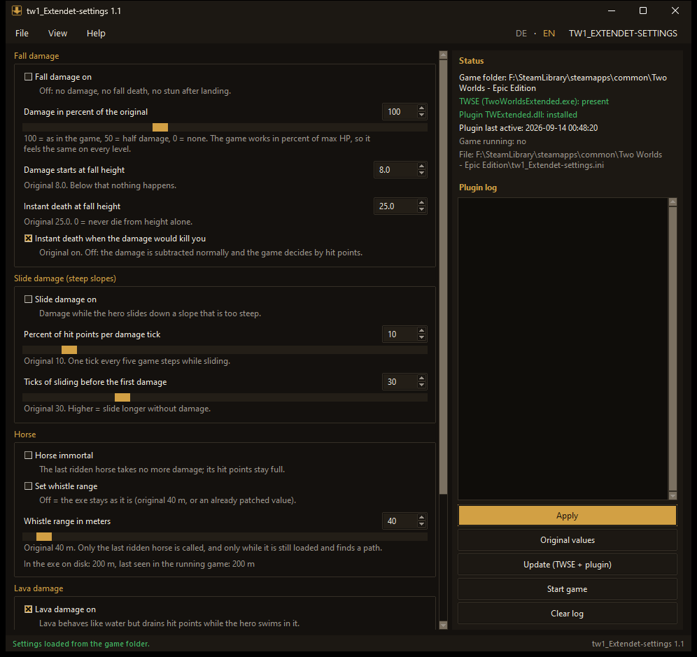
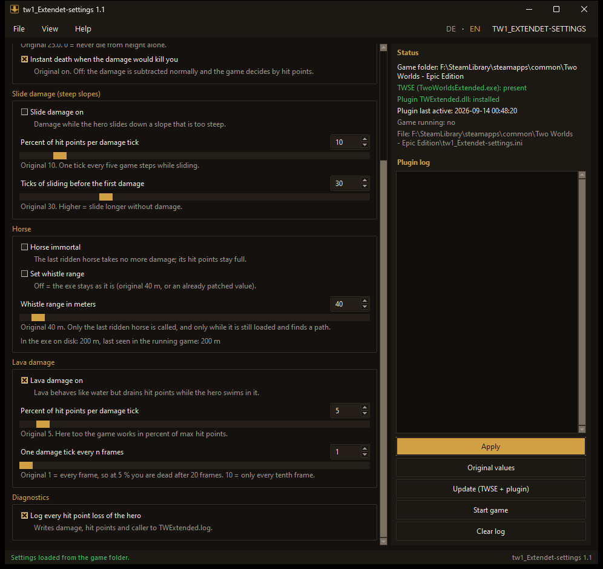
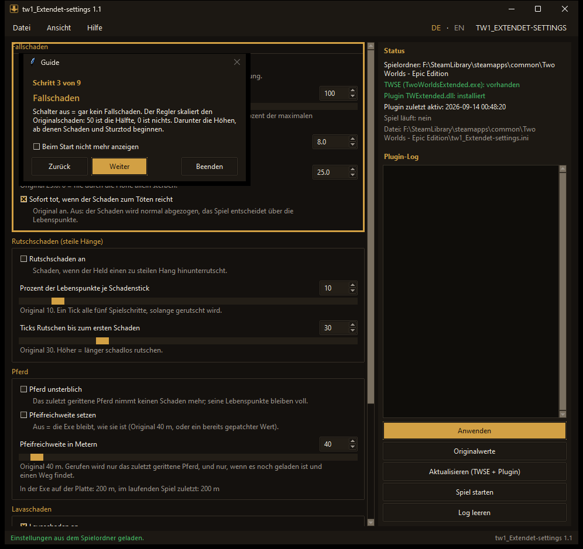

# tw1_Extendet-settings

Adjustable damage for **Two Worlds 1 (v1.7)**: fall, slide and lava damage,
an immortal horse and the whistle range, live while the game runs. Two parts:

- `TWExtended.dll` - a plugin for buglord's
  [Two Worlds Script Extender (TWSE)](https://github.com/buglord/Two-Worlds-1-Script-Extender).
  It reads `tw1_Extendet-settings.ini` from the game folder at start and
  re-reads it whenever the file changes.
- `tw1_Extendet-settings.exe` - a small window that writes that file, shows the
  plugin status and its log, and installs the plugin into the game folder.

## Download

Ready-made files are on the release page:
[TW1_Extendet-settings v1.1](https://github.com/MedievalDev/TW1_Extendet-settings/releases/tag/v1.1)
(`tw1_Extendet-settings.exe` with the plugin and TWSE embedded, and
`TWExtended.dll` alone). Windows SmartScreen may warn about the unsigned exe; "More info >
Run anyway".

## Install

1. Start `tw1_Extendet-settings.exe` and click **Install (TWSE + plugin)**.
   That creates `TwoWorldsExtended.exe` (a copy of `TwoWorlds.exe` with
   buglord's TWSE loader, the 4 GB flag and the Win11 text-input fix, exactly
   what his patcher does) plus `twse.dll`, and copies `TWExtended.dll` to
   `<Game>\TWSEPlugins\`. `TwoWorlds.exe` itself is not modified. If TWSE is
   already installed, only the plugin is copied or updated.
2. Start the game with **Start game** (or `TwoWorldsExtended.exe` directly);
   the plain exe loads no plugins.
3. Move the sliders. Every change is written after a second; the running game
   picks it up within another second. **Original values** restores the game.

`twse_patch.py` is the Python port of `twse_patcher.c` from the TWSE
repository (CC0), same byte changes and the same DJB2 checks, so it refuses
unknown exe versions.

The game folder comes from the registry
(`HKLM\SOFTWARE\WOW6432Node\Reality Pump\TwoWorlds\FileSystem\DataPath`);
File > Choose game folder overrides it.

## Help testing

Some parts are measured but not yet confirmed in the game by players. The
tool lists them under **Help > Test untested features**: pick a test, follow
the steps (the **Start** button launches `TwoWorldsExtended.exe` and notes
what is visible from outside, like new crash reports), then click **Works**
or **Does not work**. Two confirmations close a test for everyone; until then
the lava and horse sections carry "(experimental)".

Open tests: one-click install, fall damage off, lava damage, immortal horse,
whistle range.

**Help > Report a bug** and the **Report a bug** button in every error
message send a report to alchemy-fox.de. You see exactly what is sent before
anything leaves your PC: no names, no e-mail, user names in paths are
replaced by `<user>`. **Help > Known issues** shows what was reported and its
status.

## What is adjustable

| Setting | Original | Meaning |
|---|---|---|
| Fall damage on | on | off = no damage, no fall death, no stun |
| Fall damage percent | 100 | scale of the original damage, 0 = none |
| Damage starts at height | 8.0 | below this nothing happens |
| Instant death at height | 25.0 | 0 = never die from height alone |
| Lethal | on | instant death when the damage would kill you |
| Slide damage on | on | damage while sliding down steep slopes |
| Slide percent per tick | 10 | percent of max HP every five game steps |
| Slide grace ticks | 30 | sliding ticks before damage starts |
| Lava damage on | on | damage while swimming in lava |
| Lava percent per tick | 5 | percent of max HP per damage tick |
| Lava tick every n frames | 1 | original: every frame, so 5 % x 20 frames = dead in under a second |
| Horse immortal | off | the last ridden horse takes no damage, its HP stay full |
| Whistle range | 40 m | distance the horse answers the whistle from; switch off = leave the exe value (a patched exe keeps its value) |
| Log damage | off | log every HP loss of the hero with the caller address |

## Trainer

The folder `trainer\` holds the TW Trainer, a second TWSE plugin: godmode,
infinite gold and mana, run speed, Shift sprint, lockpicking, kill target,
teleporters unlocked, and console access to every vanilla command. Drop
`trainer\bin\TWSEPlugins\TWTrainer.dll` next to `TWExtended.dll` in
`<Game>\TWSEPlugins\`; hotkeys and commands are in
[trainer/README.md](trainer/README.md). Singleplayer only.

## How it works (TwoWorlds.exe 1.7)

Fall damage lives in the PhysX character controller of the hero. Its vtable
(`0x9E3164`) slot `+0xAC` is the landing routine `0x754370`:
height = fall value * 0.1; below 8.0 nothing; above 25.0 instant death;
otherwise percent = (height - 8) * 0.0588 * 100 of max HP, and instant death
if that damage would kill. The percent travels in the hero's position message
and is applied by `0x585A40`, the same routine the console command `hitfall`
uses. The plugin replaces the vtable slot with its own routine.

Slide damage is in the controller's five-tick update `0x7556D0`: after 30
sliding ticks (`cmp [esi+0x128], 0x1E` at `0x755770`) it calls
SetFallPercent(10) (`push 0xA` at `0x75577E`). The plugin patches both bytes.

Lava is in the controller's swim update `0x7563E0`: it walks the liquid table
and, when the hero is inside a liquid whose lava flag (`[liquid+0x4C]`) is
set, calls SetFallPercent(5) every frame (`push 5; mov ecx,esi; call eax` at
`0x75650F`). So lava damage travels the same path as fall damage. The plugin
replaces those six bytes with a call into a small thunk that applies the
configured percent and rate. Found with the damage log: every lava hit had
caller `0x585AF9`, inside the fall-damage routine.

Horse: the plugin hooks the horse class's SubHP slot (`+0x138`) and drops any
damage to the hero's last ridden horse (`EC_GetHorse`, fallback
`[Hero+0x62C]`), and refills its HP every frame. The whistle range is the
immediate of `cmp eax, 0xA00` at `0x68188A` in the horse-call tick
`0x681760` (64 units per meter, see `QuestForge\HANDOFF_PFERD.md`); the plugin
writes meters * 64 there while the switch is on and restores the value it
first saw when the switch is off.

In-game console: `twext.reload`, `twext.status`, `twext.log <0|1>`.
Files next to the game exe: `tw1_Extendet-settings.ini`, `TWExtended.log`,
`TWExtended.status`.

## Build

- Plugin: `build_extended.bat` (Tiny C Compiler, 32-bit; `..\tcc\tcc.exe`).
  Offline tests: `tcc -o t.exe test_extended.c && t.exe`.
- Tool exe: `build_settings_exe.bat` (PyInstaller, Python 3.13). Embeds the
  plugin DLL from `bin\TWSEPlugins\` and `bin\twse.dll` (TWSE by buglord,
  CC0). Run the plugin build first.
- Script mode: `python tw1_extended_settings.py` (needs `theme.py` next to it).

Language: English by default, German when the Windows display language is
German; switch with `DE · EN` at the top right.

License: CC0. Built on TWSE by buglord; the TWSE headers, `twse.dll` and the
patch logic in `twse/` and `twse_patch.py` are his work (CC0).

## Screenshots

Main window, English:

Lower part: lava, horse, diagnostics:

German, with the first-start guide:

