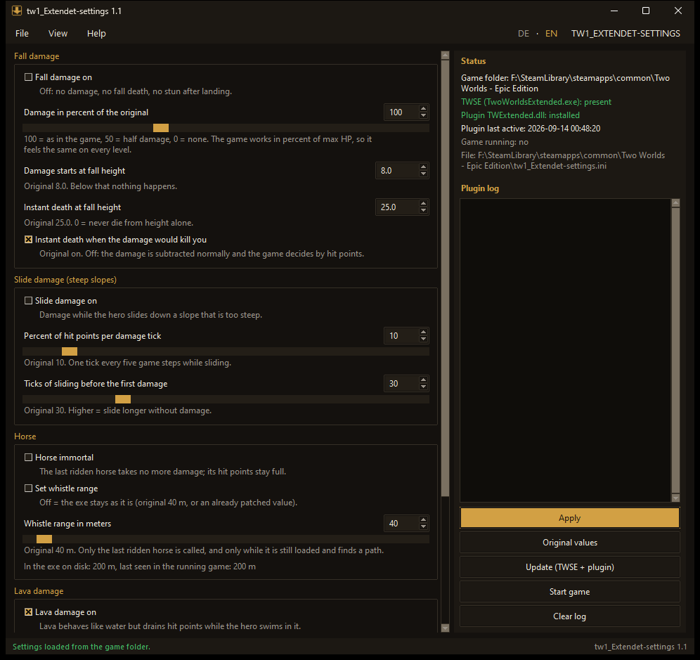
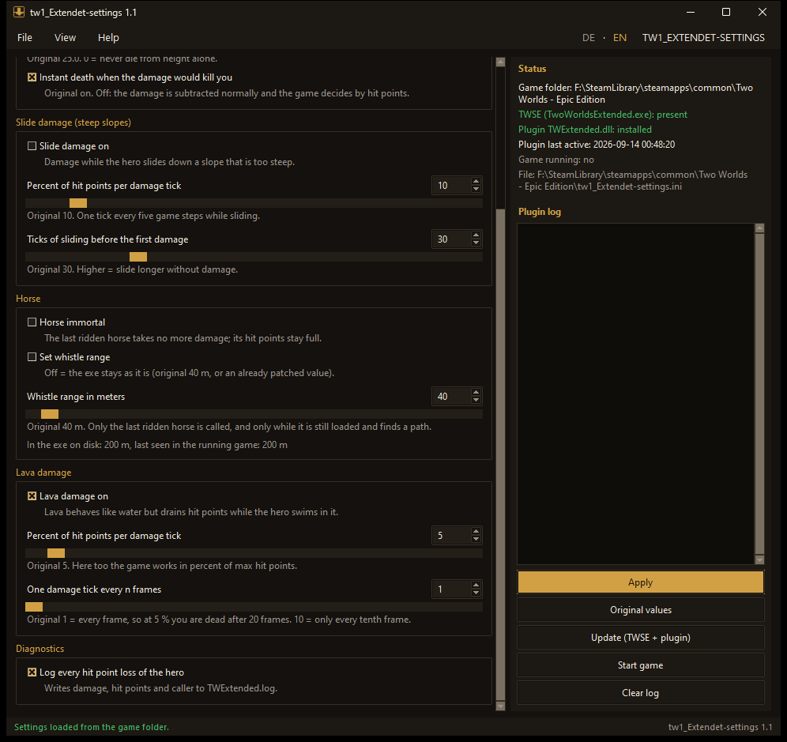
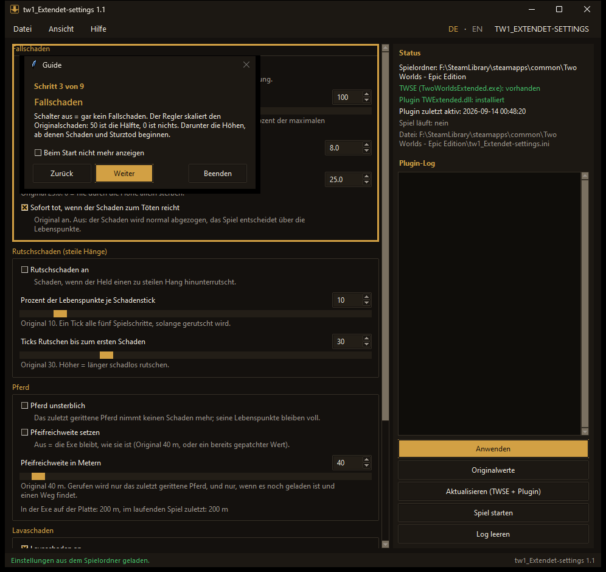

# tw1_Extendet-settings

Adjustable damage for **Two Worlds 1 (v1.7)**: fall, slide, lava and poison
damage, an immortal horse and the whistle range, live while the game runs. The tool
can open itself with the game. Two parts:

- `TWExtended.dll` - a plugin for buglord's
  [Two Worlds Script Extender (TWSE)](https://github.com/buglord/Two-Worlds-1-Script-Extender).
  It reads `tw1_Extendet-settings.ini` from the game folder at start and
  re-reads it whenever the file changes.
- `tw1_Extendet-settings.exe` - a small window that writes that file, shows the
  plugin status and its log, and installs the plugin into the game folder.

Website: [alchemy-fox.de/game/TW1_ExtendedSettings](https://alchemy-fox.de/game/TW1_ExtendedSettings/)

## Download

Ready-made files are on the release page:
[latest release](https://github.com/MedievalDev/TW1_Extendet-settings/releases/latest)
(`tw1_Extendet-settings.exe` with the plugin and TWSE embedded, and
`TWExtended.dll` alone). Windows SmartScreen may warn about the unsigned exe; "More info >
Run anyway".

## Install

1. Start `tw1_Extendet-settings.exe`. On the first start (since 1.4.0) it
   finds the game folder and sets everything up by itself: it creates
   `TwoWorldsExtended.exe` (a copy of `TwoWorlds.exe` with buglord's TWSE
   loader, the 4 GB flag and the Win11 text-input fix, exactly what his
   patcher does) plus `twse.dll`, and copies `TWExtended.dll` to
   `<Game>\TWSEPlugins\`. `TwoWorlds.exe` itself is not modified. An outdated
   plugin is replaced the same way on every start; an existing TWSE stays as
   it is. While the game runs it
   waits and installs as soon as the game is closed. **Install (TWSE +
   plugin)** does the same by hand.
   - Game under "Program Files" without write access: an error window offers
     **Restart as administrator**; that is needed once.
   - Unknown exe version (not 1.7): the error is shown once per tool version,
     nothing is changed.
   - Started by the game (autostart) the tool never installs anything.
2. Start the game with **Start game** (or `TwoWorldsExtended.exe` directly);
   the plain exe loads no plugins.
3. Move the sliders. Every change is written after a second; the running game
   picks it up within another second. **Original values** restores the game.

### Autostart (1.3.0)

Under **Autostart**, tick **Open when the game starts**. From the next start
via `TwoWorldsExtended.exe` the plugin opens the tool together with the game:

- **Start minimized** (default on): the tool opens minimized and does not take
  the focus, so the fullscreen game stays in front. Alt+Tab to it, change a
  value, it takes effect right away. Untick it with two monitors.
- **Close with the game** (default on): the tool quits when the game quits.
- The tool writes its own path into the `[Autostart]` section of the ini
  (`ToolPath`, `ToolArgs`), so it does not matter where the exe lives. It never
  runs twice: it holds the lock `Local\TW1ExtendedSettings`, and the plugin
  skips the start while it is held.
- Needs the plugin from 1.3.0 - the status on the right says "outdated" until
  **Update** has copied it.

`twse_patch.py` is the Python port of `twse_patcher.c` from the TWSE
repository (CC0), same byte changes and the same DJB2 checks, so it refuses
unknown exe versions.

The game folder: the one chosen under File > Choose game folder, else the
registry (`HKLM\SOFTWARE\WOW6432Node\Reality Pump\TwoWorlds\FileSystem\DataPath`),
else every Steam library (`libraryfolders.vdf`), else the usual Steam, GOG and
retail folders. If none has a `TwoWorlds.exe`, the tool asks once.

## Help testing

Some parts are measured but not yet confirmed in the game by players. The
tool lists them under **Help > Test untested features**: pick a test, follow
the steps (the **Start** button launches `TwoWorldsExtended.exe` and notes
what is visible from outside, like new crash reports), then click **Works**
or **Does not work**. Two confirmations close a test for everyone; until then
the lava, poison and horse sections carry "(experimental)".

Open tests: one-click install, install on first start, fall damage off, lava
damage, poison damage, immortal horse, whistle range, autostart with the game.

**Help > Report a bug** and the **Report a bug** button in every error
message send a report to alchemy-fox.de. You see exactly what is sent before
anything leaves your PC: no names, no e-mail, user names in paths are
replaced by `<user>`. **Help > Known issues** shows what was reported and its
status.

## What is adjustable

| Setting | Original | Meaning |
|---|---|---|
| Fall damage on | on | off = no damage, no fall death, no stun |
| Fall damage percent | 100 | scale of the original damage, 0 = none |
| Damage starts at height | 8.0 | below this nothing happens |
| Instant death at height | 25.0 | 0 = never die from height alone |
| Lethal | on | instant death when the damage would kill you |
| Slide damage on | on | damage while sliding down steep slopes |
| Slide percent per tick | 10 | percent of max HP every five game steps |
| Slide grace ticks | 30 | sliding ticks before damage starts |
| Lava damage on | on | damage while swimming in lava |
| Lava percent per tick | 5 | percent of max HP per damage tick |
| Lava tick every n frames | 1 | original: every frame, so 5 % x 20 frames = dead in under a second |
| Poison damage per tick | 100 % | scale of the damage per poison tick, all poisoned units, rounded down; 0 = none |
| Poison tick interval | 31 | unit updates between poison ticks, 1..127; a countdown already running ends with the old value |
| Horse immortal | off | the last ridden horse takes no damage, its HP stay full |
| Whistle range | 40 m | distance the horse answers the whistle from; switch off = leave the exe value (a patched exe keeps its value) |
| Log damage | off | log every HP loss of the hero with the caller address |
| Open when the game starts | off | the plugin opens this tool with the game |
| Start minimized | on | the game keeps the focus |
| Close with the game | on | the tool quits when the game quits |

Always on (no setting): in the hero window, **Ctrl + click on an attribute**
(vitality, dexterity, strength, willpower) spends 10 points at once instead
of 1 - or as many as are left. Taking points back (right click) stays at 1.

## Trainer

The folder `trainer\` holds the TW Trainer, a second TWSE plugin: godmode,
infinite gold and mana, run speed, Shift sprint, lockpicking, kill target,
teleporters unlocked, and console access to every vanilla command. Drop
`trainer\bin\TWSEPlugins\TWTrainer.dll` next to `TWExtended.dll` in
`<Game>\TWSEPlugins\`; hotkeys and commands are in
[trainer/README.md](trainer/README.md). Singleplayer only.

## How it works (TwoWorlds.exe 1.7)

Fall damage lives in the PhysX character controller of the hero. Its vtable
(`0x9E3164`) slot `+0xAC` is the landing routine `0x754370`:
height = fall value * 0.1; below 8.0 nothing; above 25.0 instant death;
otherwise percent = (height - 8) * 0.0588 * 100 of max HP, and instant death
if that damage would kill. The percent travels in the hero's position message
and is applied by `0x585A40`, the same routine the console command `hitfall`
uses. The plugin replaces the vtable slot with its own routine.

Slide damage is in the controller's five-tick update `0x7556D0`: after 30
sliding ticks (`cmp [esi+0x128], 0x1E` at `0x755770`) it calls
SetFallPercent(10) (`push 0xA` at `0x75577E`). The plugin patches both bytes.

Lava is in the controller's swim update `0x7563E0`: it walks the liquid table
and, when the hero is inside a liquid whose lava flag (`[liquid+0x4C]`) is
set, calls SetFallPercent(5) every frame (`push 5; mov ecx,esi; call eax` at
`0x75650F`). So lava damage travels the same path as fall damage. The plugin
replaces those six bytes with a call into a small thunk that applies the
configured percent and rate. Found with the damage log: every lava hit had
caller `0x585AF9`, inside the fall-damage routine.

Poison is a countdown per unit: `0x4BEC80` adds to the poison pool
(`[unit+0x148]`) and starts the countdown `[unit+0x144]` at 30 (`0x4BECD9`);
the unit tick `0x4BED10` counts down, and at 0 asks the script callback
`0x57D5A0` for the damage (it also drains the pool), deals it through the
unit's damage slot `+0x158` with the poisoner as attacker, and reloads the
countdown with `and eax, 0x1F; add eax, -1` (`0x4BED74`), so a tick every 31
updates while poison is left. The plugin writes the interval into both
immediates (the `and` takes a sign-extended byte, hence 1..127) and replaces
the five bytes `push eax; mov ecx, edi; call edx` at `0x4BED5B` with a call
into a thunk that scales the damage and then calls the original slot with the
same stack, so pool, attacker and death handling stay the game's own.

Horse: the plugin hooks the horse class's SubHP slot (`+0x138`) and drops any
damage to the hero's last ridden horse (`EC_GetHorse`, fallback
`[Hero+0x62C]`), and refills its HP every frame. The whistle range is the
immediate of `cmp eax, 0xA00` at `0x68188A` in the horse-call tick
`0x681760` (64 units per meter, see `QuestForge\HANDOFF_PFERD.md`); the plugin
writes meters * 64 there while the switch is on and restores the value it
first saw when the switch is off.

In-game console: `twext.reload`, `twext.status`, `twext.log <0|1>`.
Files next to the game exe: `tw1_Extendet-settings.ini`, `TWExtended.log`,
`TWExtended.status`.

## Build

- Plugin: `build_extended.bat` (Tiny C Compiler, 32-bit; `..\tcc\tcc.exe` or
  `set TCC=...`). Offline tests: `tcc -Itwse -o t.exe test_extended.c -luser32 && t.exe`.
- Tool tests: `py -3.13 -m unittest discover -s tests -t .`
- Tool exe: `build_settings_exe.bat` (PyInstaller, Python 3.13). Embeds the
  plugin DLL from `bin\TWSEPlugins\` and `bin\twse.dll` (TWSE by buglord,
  CC0). Run the plugin build first.
- Script mode: `python tw1_extended_settings.py` (needs `theme.py` next to it).

Language: English by default, German when the Windows display language is
German; switch with `DE · EN` at the top right.

License: CC0. Built on TWSE by buglord; the TWSE headers, `twse.dll` and the
patch logic in `twse/` and `twse_patch.py` are his work (CC0).

## Screenshots

Main window, English:

Lower part: lava, horse, diagnostics:

German, with the first-start guide:

## Changelog

### 1.5.0 (04.10.2026)

- **Ctrl + click on an attribute** in the hero window spends 10 points at
  once. The plugin redirects the click handler's call 0x5FA7F1 -> 0x5FA030
  (stdcall: dialog, attribute, increase); with Ctrl held it calls it 10
  times, the script (`IncreasePoint`) refuses calls beyond the free points.
  Taking back stays at 1 (only the window checks that limit). Status file:
  `param_ctrl_hook`. Plugin revision 6.
- Please help testing: Help > Test untested features.

### 1.4.0 (04.10.2026)

- **Sets itself up:** on a normal start the tool finds the game (registry,
  Steam libraries, usual folders) and installs TWSE and the plugin when one is
  missing or the plugin is outdated - no click needed. While the game runs it
  waits until the game is closed. Missing write access offers a restart as
  administrator; errors show once per version, the button always works.
- **Poison damage (experimental):** damage per poison tick in percent and the
  tick interval, for all poisoned units; section `[PoisonDamage]` in the ini.
- Plugin revision 5 (poison hook, status lines `poison_hook`, `poison_applied`,
  `poison`).

### 1.3.1 (23.09.2026)

- Help > Guide page opens the new website alchemy-fox.de/game/TW1_ExtendedSettings/
  (the old address was a dead link). Plugin unchanged.

### 1.3.0 (23.09.2026)

- **Autostart:** the plugin can open the settings tool when the game starts -
  minimized without taking the focus, and closing again with the game. Off by
  default; section `[Autostart]` in the ini.
- The tool runs only once; a second start brings the open window to the front.
- The status shows when the installed plugin is older than the one in the tool.
- Plugin revision 4: reads `ToolPath`/`ToolArgs` verbatim (paths may contain
  `;` and `#`), starts the tool through the Unicode API (paths with umlauts),
  writes the autostart result to `TWExtended.status`.

### 1.2.0 (20.09.2026)

- Test window, bug reports and known issues.
